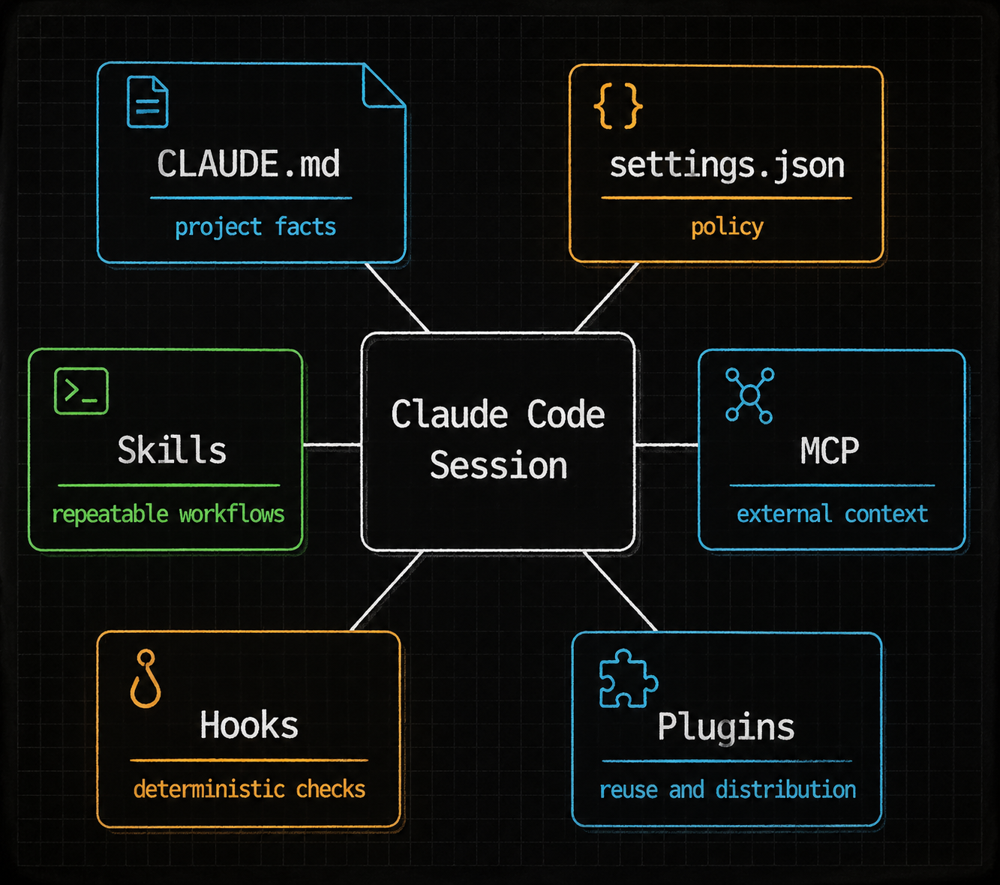
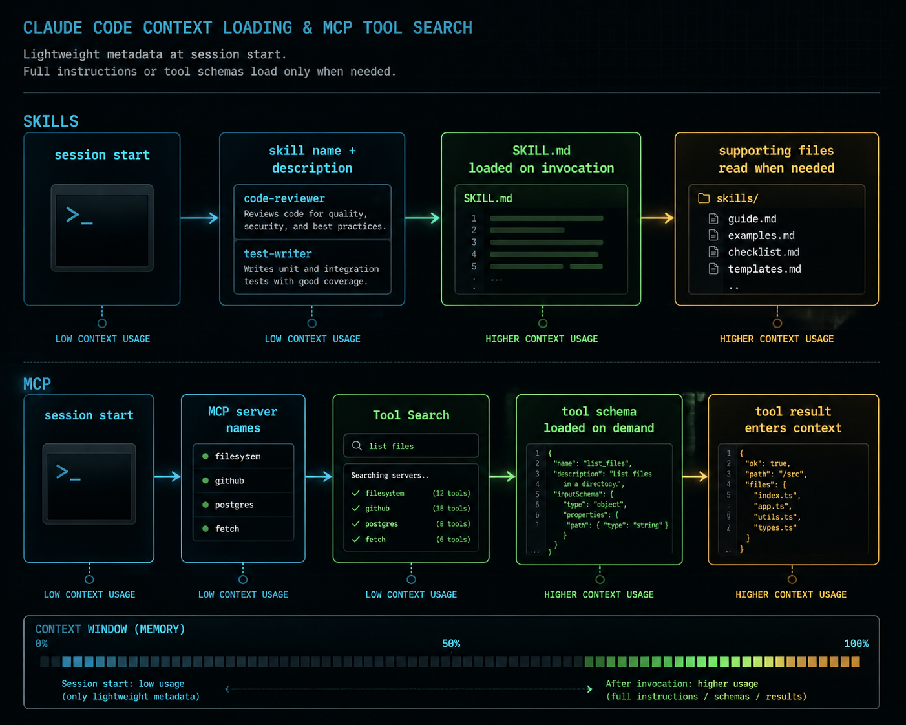

**TL;DR** — Claude Code 的配置问题，核心不是“再多装几个工具”，而是把不同类型的上下文放到正确位置。项目事实放 `CLAUDE.md`，可复用流程放 Skill，外部系统接入走 MCP，硬性约束放 Hook，跨仓库复用再做 Plugin。本文按 2026 年 4 月 27 日的官方文档口径重写，只记录我会在真实项目里采用的做法和需要避开的坑。

本文不讲安装和账号登录。那部分已经被写烂了，而且变化快。这里讨论的是：一个仓库已经能跑 Claude Code 之后，怎样把它调成一个稳定的工程工具，而不是一份越来越长的提示词。

## 一张边界表

先把几个概念摆平。



| 配置层 | 应该放什么 | 不应该放什么 |
| --- | --- | --- |
| `CLAUDE.md` | 项目事实、架构约束、构建和测试命令、容易踩的坑 | 大段流程、发布 SOP、临时任务说明 |
| `.claude/settings.json` | 权限、Hook、环境变量、团队共享策略 | 密钥、个人偏好、机器相关路径 |
| `.claude/settings.local.json` | 个人本地配置、实验开关、私有 token 引用 | 需要团队复用的规则 |
| Skill | 某类任务的步骤、检查清单、模板、参考资料 | 外部系统连接、长期项目事实 |
| MCP | GitHub、浏览器、数据库、日志、内部文档等外部上下文 | 编码规范、流程说明 |
| Hook | 必须执行或必须拦截的动作 | “希望 Claude 记住”的建议 |
| Plugin | 跨仓库复用的一整套 Skills、Hooks、MCP、Agents | 当前项目的一次性配置 |

我的经验是：一旦 `CLAUDE.md` 开始出现“先做 A，再做 B，最后输出 C”这种句子，就该考虑拆成 Skill。`CLAUDE.md` 更像项目 README 的机器可读版，Skill 才是操作手册。

## Skills：把流程从提示词里移出去

Claude Code 现在把自定义 slash command 和 Skill 合并了。`.claude/commands/deploy.md` 还能用，但新东西建议写成 `.claude/skills/<name>/SKILL.md`。原因不是语法更时髦，而是 Skill 能带自己的目录、支持文件、触发条件、工具预授权、子代理上下文和动态参数。

Skill 的加载方式也很重要：会话启动时通常只加载名称和描述，`SKILL.md` 正文在触发后才进入上下文。这个机制解决了一个老问题：你可以保留比较完整的流程文档，而不用每次会话都消耗上下文。

一个项目级 Skill 大概长这样：

```text
.claude/
└── skills/
    └── release-check/
        ├── SKILL.md
        ├── checklist.md
        └── scripts/
            └── collect-diff.ps1
```

`SKILL.md` 示例：

```md
---
name: release-check
description: Check release risk before tagging or deploying. Use when the user asks for release review, version bump review, changelog validation, or pre-deploy verification.
when_to_use: Run this for release-related changes, dependency upgrades, schema changes, and deployment config changes.
argument-hint: "[base-ref]"
disable-model-invocation: true
allowed-tools:
  - Read
  - Grep
  - Glob
  - Bash(git status)
  - Bash(git diff --stat *)
  - Bash(pnpm test *)
  - Bash(pnpm build *)
paths:
  - src/**
  - package.json
  - pnpm-lock.yaml
  - .github/**
shell: powershell
---

Use `$ARGUMENTS` as the base ref. If it is empty, use `main`.

Steps:
1. Inspect dependency, schema, environment, build script, and public API changes.
2. Run the smallest relevant verification command first.
3. Report only release blockers, rollback notes, and manual checks.
4. If no meaningful risk is found, say so directly.

For the detailed checklist, read `${CLAUDE_SKILL_DIR}/checklist.md`.
```

几个细节值得单独记：

- `description` 是路由条件，不是简介。它要写“什么时候用”，不要写空泛能力。
- `disable-model-invocation: true` 适合发布、部署、提交这类你想手动触发的流程。
- `allowed-tools` 是预授权，不是工具白名单；真正的禁止规则仍然要写到权限的 `deny`。
- `paths` 能降低误触发，尤其适合 monorepo。
- `shell: powershell` 只在启用 PowerShell 工具后有意义。
- 复杂参考资料放旁路文件，不要把 `SKILL.md` 写成几千行。

我通常把 Skill 控制在一个问题域内。比如 `release-check` 只做发布检查，不顺手生成 changelog，也不顺手打 tag。范围越窄，Claude 越不容易把流程扩写成一段看似完整但不可执行的叙述。

## MCP：接外部系统，不是堆工具名

MCP 要解决的是外部上下文接入。它适合接 GitHub、Playwright、数据库、日志、内部文档、工单系统。它不适合存放“这个项目的代码风格是什么”。

项目共享的 MCP 配置应放在仓库根目录的 `.mcp.json`。这类配置可以进版本控制，但密钥只做环境变量引用。

```json
{
  "mcpServers": {
    "github": {
      "command": "npx",
      "args": ["-y", "@modelcontextprotocol/server-github"],
      "env": {
        "GITHUB_TOKEN": "${GITHUB_TOKEN}"
      }
    },
    "playwright": {
      "command": "npx",
      "args": ["-y", "@playwright/mcp@latest"]
    }
  }
}
```

对应的项目策略可以放在 `.claude/settings.json`：

```json
{
  "$schema": "https://json.schemastore.org/claude-code-settings.json",
  "enabledMcpjsonServers": ["github", "playwright"],
  "permissions": {
    "allow": [
      "mcp__github__get_*",
      "mcp__github__list_*",
      "mcp__playwright__*"
    ],
    "deny": [
      "mcp__github__delete_*",
      "mcp__github__merge_*"
    ]
  }
}
```

MCP 的作用域也要分清：

| Scope | 用途 | 是否适合提交 |
| --- | --- | --- |
| Local | 当前项目、当前机器的私有 server | 不适合 |
| Project | 当前项目团队共享 server | 适合，通常是 `.mcp.json` |
| User | 所有项目可用的个人 server | 不适合 |
| Plugin | 插件自带 server | 跟插件一起分发 |

同名 server 同时出现在多个地方时，Claude Code 会按优先级连接一次。实际写配置时，我会避免同名覆盖，尤其不要在用户级和项目级都叫 `github`，除非你非常确定自己要覆盖什么。

## Tool Search：很多 MCP 配置慢，是因为 schema 太多

MCP server 多了之后，问题不是工具数量本身，而是工具 schema 占上下文。Claude Code 的 Tool Search 会先只加载工具名，需要时再展开定义。



这里有一个国内用户常见坑：如果你设置了非官方的 `ANTHROPIC_BASE_URL`，Tool Search 默认可能不会强开，因为很多代理不会转发 `tool_reference`。确认代理支持以后再显式设置：

```json
{
  "env": {
    "ENABLE_TOOL_SEARCH": "true"
  }
}
```

如果你不确定代理是否支持，先用：

```powershell
$env:ENABLE_TOOL_SEARCH = "auto:5"
claude --debug
```

观察 debug 日志里 MCP schema 是一次性塞进上下文，还是按需搜索。这个比凭感觉判断靠谱。

新接远程 server 时，我会优先选 HTTP transport。SSE 仍然能见到，但新配置没有必要优先走它。纯本地工具、内部脚本和轻量服务仍然可以用 stdio。

## Hooks：不要把强约束写成建议

Hook 是 Claude Code 里最容易被低估的一层。它的定位很明确：如果某件事必须发生，或者某个动作必须被拦截，就不要只写进提示词。

Hook 的 command 版本会从 stdin 收到 JSON。下面是一个 PowerShell 版危险命令拦截脚本：

```powershell
# .claude/hooks/block-dangerous.ps1
$payload = [Console]::In.ReadToEnd() | ConvertFrom-Json

if ($payload.tool_name -ne "Bash") {
  exit 0
}

$command = [string]$payload.tool_input.command
$blocked = @(
  "rm\s+-rf",
  "git\s+reset\s+--hard",
  "git\s+push\s+--force",
  "Remove-Item\s+.*-Recurse"
)

foreach ($pattern in $blocked) {
  if ($command -match $pattern) {
    [Console]::Error.WriteLine("Blocked by project policy: $command")
    exit 2
  }
}

exit 0
```

在 `.claude/settings.json` 里挂上：

```json
{
  "hooks": {
    "PreToolUse": [
      {
        "matcher": "Bash",
        "hooks": [
          {
            "type": "command",
            "command": "powershell -NoProfile -ExecutionPolicy Bypass -File .claude/hooks/block-dangerous.ps1"
          }
        ]
      }
    ]
  }
}
```

`exit 2` 会阻止工具调用。`exit 1` 只是非阻塞错误，这点很容易写错。

如果你要做更细的控制，也可以让 Hook 输出 JSON。`PreToolUse` 现在推荐使用 `hookSpecificOutput.permissionDecision`：

```json
{
  "hookSpecificOutput": {
    "hookEventName": "PreToolUse",
    "permissionDecision": "deny",
    "permissionDecisionReason": "Database write commands are blocked in this repository."
  }
}
```

我的使用边界：

- `PreToolUse`：拦危险命令、拦敏感路径、给生产环境操作加阻断。
- `PostToolUse`：格式化、轻量 lint、记录变更。
- `PostToolBatch`：在一批工具调用结束后追加上下文，比如提醒跑测试。
- `Stop`：最后检查是否有未跑的验证命令。

不要把耗时很长的测试无脑塞进 `PostToolUse`。每次编辑都跑完整 e2e，会让 Claude Code 变成一个很慢的自动保存插件。

## 权限：本地放开，远程收紧

权限配置我一般按风险分两类：

- 本地、可回滚、低成本动作：适当放开。
- 远程、不可逆、高影响动作：默认收紧。

一个保守起点：

```json
{
  "permissions": {
    "defaultMode": "normal",
    "allow": [
      "Read",
      "Edit",
      "Glob",
      "Grep",
      "Bash(git status)",
      "Bash(git diff *)",
      "Bash(pnpm test *)",
      "Bash(pnpm build *)",
      "mcp__github__get_*",
      "mcp__github__list_*"
    ],
    "deny": [
      "Read(**/.env)",
      "Read(**/.env.*)",
      "Bash(git push --force *)",
      "Bash(rm -rf *)",
      "Bash(Remove-Item * -Recurse *)",
      "mcp__github__delete_*",
      "mcp__github__merge_*"
    ]
  }
}
```

这里我宁愿一开始多问几次，也不想默认把远程写操作放开。等你知道某个 MCP 工具只读、稳定、低风险，再把它加入 allow。

## Windows 和 PowerShell：能用，但要写清楚

如果你的主力环境是 Windows，建议显式打开 PowerShell 工具预览：

```json
{
  "env": {
    "CLAUDE_CODE_USE_POWERSHELL_TOOL": "1"
  }
}
```

然后在 Skill 里用：

```yaml
shell: powershell
```

这能减少 Git Bash 和 Windows 路径之间的摩擦。代价是团队里如果有人用 macOS/Linux，同一个 Skill 里的 shell 片段就不一定可移植。我的做法是：

- 项目通用 Skill 尽量只写命令意图，少写平台脚本。
- Windows 项目的自动化脚本直接 `.ps1` 化。
- Hook 里不要依赖个人 PowerShell profile，用 `-NoProfile`。
- 需要跨平台的检查逻辑，优先写 Node/Python 脚本，再由 Hook 调用。

## Plugin：跨仓库复用时再上

单仓库内，`.claude/` 已经够用。Plugin 的意义是分发和版本管理，不是让配置看起来高级。

一个最小结构：

```text
my-team-plugin/
├── .claude-plugin/
│   └── plugin.json
├── skills/
│   └── release-check/
│       └── SKILL.md
├── hooks/
│   └── hooks.json
├── agents/
│   └── reviewer.md
└── .mcp.json
```

注意：`plugin.json` 放在 `.claude-plugin/` 里，`skills/`、`hooks/`、`agents/`、`.mcp.json` 放在插件根目录，不要塞进 `.claude-plugin/`。

我只在这几种情况下做 Plugin：

- 同一套 Skill 要在多个仓库复用。
- Hook 已经形成团队策略。
- MCP server 是团队统一维护的内部服务。
- 需要通过 marketplace 或固定目录分发。

否则，先留在 `.claude/`，维护成本更低。

## 我的配置落点

如果今天给一个真实项目从零配置，我会先落这几个文件：

```text
.claude/
├── CLAUDE.md
├── settings.json
├── settings.local.json
├── hooks/
│   └── block-dangerous.ps1
└── skills/
    ├── release-check/
    │   ├── SKILL.md
    │   └── checklist.md
    └── pr-review/
        ├── SKILL.md
        └── rubric.md

.mcp.json
```

第一轮只做这些：

1. `CLAUDE.md` 写项目事实，不超过 200 行。
2. `settings.json` 写 deny 规则、低风险 allow、PowerShell 开关。
3. `.mcp.json` 只接 GitHub 和 Playwright。
4. `release-check` 写成手动触发 Skill。
5. `block-dangerous.ps1` 拦截不可逆命令。

等这套跑顺，再加数据库、日志、内部文档这些 MCP。不要一开始就把所有东西都接进来。Claude Code 的问题通常不是能力不够，而是上下文、权限和自动化边界没有收好。

## 结论

Claude Code 的扩展系统可以按一句话理解：

> `CLAUDE.md` 记录事实，Skill 固化流程，MCP 接入外部状态，Hook 执行硬约束，Plugin 负责复用分发。

这个分法不花哨，但能减少很多长期维护问题。尤其是团队项目里，最大的收益不是 Claude 偶尔写出一段漂亮代码，而是它在反复执行同一类任务时不会每次都换一套做法。

## 参考资料

- [Extend Claude with skills](https://code.claude.com/docs/en/slash-commands)
- [Connect Claude Code to tools via MCP](https://code.claude.com/docs/en/mcp)
- [Hooks reference](https://code.claude.com/docs/en/hooks)
- [Claude Code settings](https://code.claude.com/docs/en/settings)
- [Create plugins](https://code.claude.com/docs/en/plugins)
